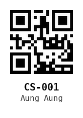
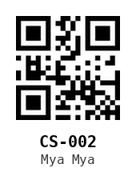
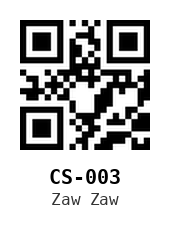

# RCsys — QR-Based Roll Call System

> `root@404SNF:~#` Take roll call in seconds — no more shouting names and marking paper.

RCsys is a full-stack, QR-based attendance system built for the classroom. The instructor
generates a printable QR card for every student once, then simply scans the cards with the
PC webcam at the end of the class. Present / absent lists and a plain-text attendance report
are generated automatically.

Built with **React 19 + Vite + Tailwind CSS** on the frontend and **Express 5** on the backend,
with a file-based storage layer — no database required.

---

## The Problem

I teach as a **Senior Mentor at UCS-Pyay**. At the end of every class I used to take roll call
manually:

- shouting out each student's name,
- waiting for an answer,
- ticking marks on paper,
- then typing everything up into a report afterwards.

With 20–30 students that's slow, noisy, error-prone, and eats into class time. I wanted a way
to capture attendance instantly from the front of the classroom without any extra hardware
or internet dependency.

## The Idea

Give every student a **printed QR card** that encodes their student ID. At the end of class,
students pass their cards in front of the PC webcam (or line up and scan quickly). The system:

1. reads each ID from the camera,
2. deduplicates repeated scans,
3. compares against the full student list,
4. saves a dated attendance report and shows who is missing.

Scanning 25 students takes **about 30 seconds** instead of 5+ minutes.

---

## How It Works

```
┌────────────┐    1. generate QR cards      ┌──────────────┐
│  ADMIN     │ ───────────────────────────► │  QR CARDS    │
│  (/admin)  │  (single PNG or all as ZIP)  │  (printed)   │
└────────────┘                              └──────────────┘
                                                      │
                                                      │ 2. students scan
                                                      ▼
┌────────────┐    3. POST /api/attendance    ┌──────────────┐
│  SCANNER   │ ───────────────────────────►  │  EXPRESS 5   │
│  (webcam)  │   { presentIds, sessionName } │  API (:5000) │
└────────────┘                               └──────┬───────┘
                                                     │ 4. read/write
                                                     ▼
                                          ┌──────────────────────┐
                                          │  ~/RCsys/ (files)    │
                                          │  student/list.txt    │
                                          │  daily/<Class>_date  │
                                          └──────────────────────┘
```

### The 4 steps

1. **Generate** — Admin opens `/admin`, the app loads the student list and renders a QR
   canvas for each student. Cards can be downloaded one-by-one as PNG, or all at once as a
   ZIP (via `jszip` + `file-saver`).
2. **Scan** — Scanner page `/` opens the webcam (`@yudiel/react-qr-scanner`), live-decodes
   QR codes, plays a short beep per successful scan, and appends the ID to a terminal-style
   `SYSTEM_LOGS` panel. Duplicate scans are ignored via a `Set`.
3. **Save** — clicking `[ EXECUTE_SAVE ]` prompts for a session name (e.g. `JS_Section_A`),
   then POSTs the present IDs to the server.
4. **Report** — the server computes absent students, writes `~/RCsys/daily/<Session>_<date>.txt`,
   and the UI shows a success summary with the missing list so you can follow up immediately.

### Sample QR cards (generated by the system)

| CS-001 | CS-002 | CS-003 |
|:------:|:------:|:------:|
|  |  |  |

---

## Tech Stack

| Layer     | Technology |
|-----------|------------|
| Frontend  | [React 19](https://react.dev) · [Vite 8](https://vite.dev) · [React Router 7](https://reactrouter.com) |
| Styling   | [Tailwind CSS 4](https://tailwindcss.com) (dark "hacker terminal" theme) |
| QR render | [qrcode.react](https://github.com/zpao/qrcode.react) (card generation) |
| QR scan   | [@yudiel/react-qr-scanner](https://github.com/yudielcurbelo/react-qr-scanner) (webcam) |
| Export    | [jszip](https://github.com/Stuk/jszip) · [file-saver](https://github.com/eligrey/FileSaver.js) |
| Backend   | [Express 5](https://expressjs.com) · [cors](https://github.com/expressjs/cors) · [nodemon](https://nodemon.io) |
| Storage   | Plain text files under `~/RCsys/` (no database) |
| Linting   | [oxlint](https://oxc.rs) |

## Repository structure

```
rowcallSys/
├── client/                 # React SPA (Vite)
│   ├── src/
│   │   ├── pages/
│   │   │   ├── AdminPage.jsx      # QR card generator
│   │   │   └── ScannerPage.jsx    # webcam scanner + save
│   │   ├── components/
│   │   │   ├── Navbar.jsx
│   │   │   ├── PromptModal.jsx    # session-name input
│   │   │   └── SummaryView.jsx    # post-save absent report
│   │   ├── App.jsx
│   │   └── main.jsx
│   ├── index.html
│   └── package.json
├── server/                 # Express API + static hosting
│   ├── index.js
│   ├── client/             # production build served by Express
│   ├── start.sh            # one-command launcher (opens browser)
│   └── package.json
└── assets/qr/              # sample QR card images (this README)
```

## Storage layout

The server stores everything under `~/RCsys/` (created automatically):

```
~/RCsys/
├── student/
│   └── list.txt            # one "ID, Name" per line
└── daily/
    └── JS_Section_A_2026-07-05.txt   # one report per session/date
```

If `list.txt` does not exist yet, the server seeds a small dummy list so you can try it out.

## API

| Method | Endpoint           | Body                             | Description                        |
|--------|--------------------|----------------------------------|------------------------------------|
| GET    | `/api/students`    | —                                | Return the student list as JSON    |
| POST   | `/api/attendance`  | `{ presentIds: [], sessionName }`| Compute present/absent, save report|

---

## Getting Started

### Prerequisites

- **Node.js 18+** and **npm**
- A webcam (for scanning)

### 1. Install dependencies

```bash
# client
cd client
npm install

# server
cd ../server
npm install
```

### 2. Run in development (hot reload)

```bash
# terminal 1 — backend API on :5000
cd server
npm run dev

# terminal 2 — frontend dev server on :5173
cd client
npm run dev
```

Then open http://localhost:5173 — the API is reached at `http://localhost:5000` (CORS is
enabled on the server).

### 3. Production build & run (single server)

```bash
# build the React app
cd client
npm run build

# copy the output into the server's static folder
rm -rf ../server/client
cp -r dist ../server/client
cp public/icons.svg public/hacker.png public/favicon.svg ../server/client/

# start the server — it serves the app + API on :5000
cd ../server
npm start        # or: ./start.sh  (opens the browser automatically)
```

Open http://localhost:5000 — this is the simplest mode for classroom use.

> Note: the production build is committed under `server/client/` so the server folder is
> deployable on its own after `npm install`.

### 4. Use it

1. Go to **`/admin`** → download all QR cards as ZIP, print and cut them.
2. Hand a card to each student (or stick them to their desks / notebooks).
3. At the end of class open **`/`**, let students scan their cards in front of the webcam,
   then hit `[ EXECUTE_SAVE ]`, type the session name, and done.
4. Find the report in `~/RCsys/daily/`.

---

## Author

- **Aster Julian Ray** — Senior Mentor, University of Computer Studies, Pyay (UCS-Pyay)
- GitHub: [@picakhant](https://github.com/picakhant)

---

*Built with ❤️ to make classroom life easier — no more shouting roll call.*